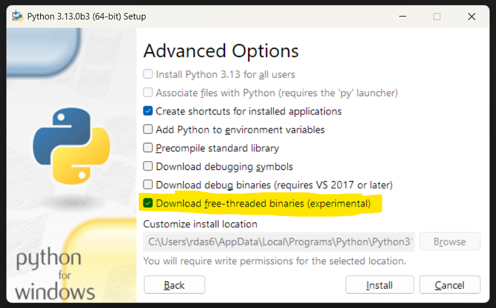
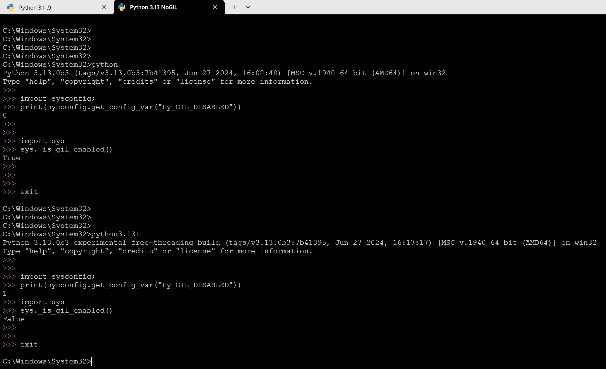
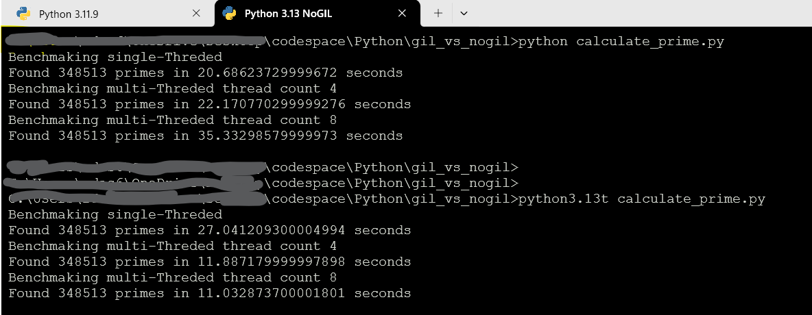

# Exploring the Latest Features in Python 3.13: Optional GIL

As the Python community continuously seeks to enhance the performance and capabilities of this versatile language, Python 3.13 introduces exciting features, most notably the introduction of an optional Global Interpreter Lock (GIL). This new feature allows developers to explore multi-threading with significantly improved performance. In this blog, I will guide you on how to download and install this version, check if GIL is disabled, and provide benchmarking code to demonstrate the performance differences.

## What is GIL and Why is it Important?

The Global Interpreter Lock (GIL) is a mutex that protects access to Python objects, preventing multiple threads from executing Python bytecodes at once. While this simplifies memory management, it can become a bottleneck for CPU-bound applications that rely heavily on multi-threading. With Python 3.13, you have the option to run Python without the GIL, which can lead to substantial performance improvements in certain multi-threaded applications.

## How to Download Python 3.13

To get started, you can download the experimental version of Python 3.13 from the official Python release page:

[Download Python 3.13](https://python.org/downloads/release/python-3130b3/)

## How to Install Python 3.13

During the installation process, make sure to check the option for **Free Threaded Binaries (experimental)**. This option will enable the GIL-free version of Python on your system, allowing you to take advantage of its multi-threading capabilities.



Once installation is complete, check the installation directory; you should see two Python executables:
- `python.exe`
- `python3.13t.exe` (This is the GIL-free version.)

## Verifying GIL is Disabled

Once you have installed Python 3.13, it’s essential to verify that the GIL is indeed disabled. You can check this by running one of the following commands in your Python environment:

```python
import sysconfig
print(sysconfig.get_config_var("Py_GIL_DISABLED"))
```

Alternatively, you can use:

```
import sys 
sys._is_gil_enabled()  
```



# Running Your Code: GIL Disabled vs. GIL Enabled
You can run your multi-threaded scripts with the GIL disabled by using the following command:
```
python3.13t <your_multithreaded_code.py>
```

To execute your code with GIL enabled, use:

```
python <your_multithreaded_code.py>
```

# Benchmarking Multi-Threading Performance
To illustrate the performance enhancements available with the GIL-free version, here’s a benchmarking code snippet that counts prime numbers using single-threaded and multi-threaded approaches:



Here is the ![./scripts/calculate_prime.py]

This code benchmarks the performance of counting prime numbers in range 2 to 5000000 using both single-threaded and multi-threaded approaches. It allows you to see how the GIL impacts performance based on the number of threads used.

# Conclusion
The introduction of an optional GIL in Python 3.13 represents a significant evolution in the language, particularly for CPU-bound applications. With proper installation and configuration, developers can harness the power of multi-threading with improved performance. Test it out for your applications, and stay tuned for future updates from the Python community!

Happy coding!